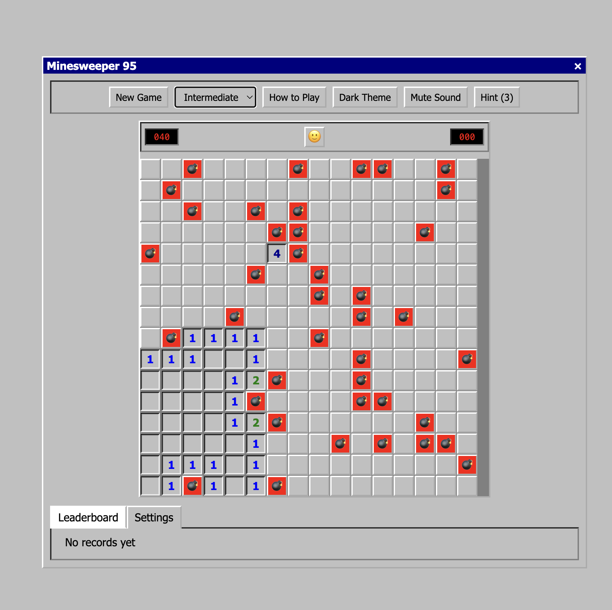

# Windows 95 Style Minesweeper Game

A modern implementation of the classic Minesweeper game with a retro Windows 95 visual style. Built using vanilla JavaScript, HTML, and CSS with no external dependencies.

> **For developers:** Check out the [detailed technical documentation](DOCUMENTATION.md) for code structure, algorithms, and implementation details.

<p align="center">
  
</p>

## Play Now

Simply open `index.html` in any modern browser to start playing immediately. No server or build process required!

## Features

- **Classic Minesweeper Gameplay**
  - Left-click to reveal cells, right-click to flag mines
  - Numbers indicate adjacent mines
  - Safe first click
  - Win by revealing all non-mine cells
  
- **Multiple Difficulty Levels**
  - Beginner: 9x9 grid with 10 mines
  - Intermediate: 16x16 grid with 40 mines
  - Expert: 30x16 grid with 99 mines
  - Custom: Create your own board size and mine count
  
- **Special Board Templates**
  - Classic rectangular grid
  - Heart shape
  - Smiley face
  - Spiral pattern
  
- **Extra Features**
  - Windows 95 retro styling
  - Dark/light theme toggle
  - Sound effects (with mute option)
  - Hint system with limited hints per game
  - Auto-flag obvious mines option
  - Local storage for leaderboard and settings
  - Keyboard shortcuts
  - Responsive design for all screen sizes
  
- **Keyboard Shortcuts**
  - `N`: New game
  - `H`: Use hint
  - `Space`: Pause/resume game

## How to Play

1. Left-click to reveal a cell
2. Right-click to flag a suspected mine
3. Numbers indicate how many mines are adjacent to that cell
4. Clear all non-mine cells to win
5. If you click on a mine, you lose!

## Code Structure

The game is built using a modular architecture that's bundled into a single file:

### Core Modules

1. **Game Module** (`game.js` → lines 818-1258)
   - Core game mechanics and board generation
   - Event handling and win/lose conditions
   - Board template rendering (heart, smiley, spiral patterns)
   - Auto-flagging logic and hint system

2. **UI Module** (`ui.js` → lines 660-816)
   - Board rendering and cell creation
   - Timer and mines counter updates
   - Face button state management
   - Leaderboard display

3. **Sounds Module** (`sounds.js` → lines 556-612)
   - Sound effects management with fallback mechanism
   - Volume control and mute toggle
   - Error handling for sound loading

4. **Storage Module** (`storage.js` → lines 614-658)
   - Local storage for game state, settings, and leaderboard
   - Score saving and loading
   - Settings persistence

### CSS Highlights

1. **Windows 95 Styling** (lines 16-74)
   - Custom CSS variables for Windows 95 colors and borders
   - Proper shadow effects for buttons and windows
   - Dark mode theme variables and overrides

2. **Responsive Design** (lines 383-397)
   - Mobile-optimized layout for various screen sizes
   - Adaptable grid and controls

3. **Layout Components** (lines 75-198)
   - Windows-style window frames with title bars
   - Classic Windows 95 buttons and controls
   - Game grid with proper cell styling

## Files Included

### Project Structure
- `index.html` - The complete standalone game with no external dependencies
- `css/styles.css` - Original CSS file (not used in the standalone version)
- `js/` - Original module files (not used in the standalone version)
- `assets/` - Folder for sounds and images
- `screenshot.png` - Screenshot for the README
- `DOCUMENTATION.md` - Detailed technical documentation for developers

All code (HTML, CSS, and JavaScript) has been combined into a single `index.html` file for simplicity and ease of use. This makes the game:
- Easy to share - just send one file
- Easy to deploy - no server required
- Easy to run - double-click to open in any browser

## Technical Implementation Details

### Game Board Generation

The game uses a dynamic grid system with mathematical formulas to create special board templates:
- **Heart Template**: Uses a parametric heart curve equation (lines 726-727)
- **Smiley Template**: Combines circular shapes for face, eyes, and smile (lines 732-741)
- **Spiral Template**: Uses polar coordinates to create a spiral pattern (lines 746-748)

### Intelligent Auto-Flagging

The auto-flag feature (lines 1023-1064) uses pattern recognition to identify cells that must contain mines:
- Analyzes revealed numbered cells
- Counts adjacent hidden cells and flags
- Automatically flags cells when the count matches the number

### Sound System with Fallbacks

The sound system includes robust error handling (lines 568-574):
- Tries to load sounds from external sources
- Falls back gracefully if sounds can't be loaded
- Prevents UI errors by handling audio errors

## Running Locally

Simply open `index.html` in any web browser. No server or internet connection required.

## GitHub Repository Setup

To set up this project on GitHub:

1. Create a new repository on GitHub
2. Initialize the repository locally and push the code:
```bash
git init
git add .
git commit -m "Initial commit: Windows 95 style Minesweeper game"
git branch -M main
git remote add origin https://github.com/yourusername/minesweeper-95.git
git push -u origin main
```

3. Enable GitHub Pages in your repository settings to make the game playable online.

## Future Improvements

Some potential features for future development:
- Mobile touch support with long-press for flagging
- Time-based challenges and achievements
- Save game state for continuing later
- Animation effects for explosions and victories
- More board shape templates

## License

This project is open source and available for anyone to use and modify.

## Acknowledgements

- Inspired by the classic Windows 95 Minesweeper game
- Built using vanilla JavaScript, HTML, and CSS